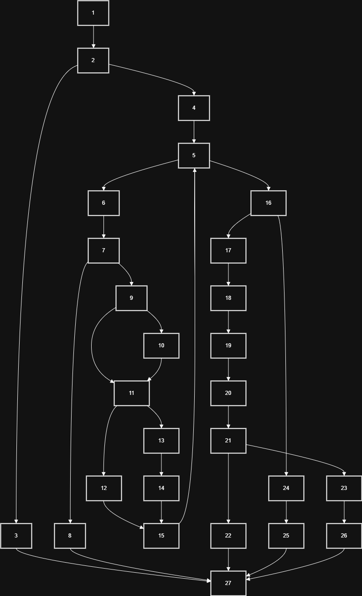

# Atanasova Martina 225026

# 2. CFG 

# 3. Цикломатска комплексност
Цикломатската комплексност на функцијата checkCart е 6, пресметана според формулата CC = E - N + 2, со 31 раб, 27 јазли и 1 поврзана компонента.

# 4.
checkCart(null, "1234567890123456") 
checkCart(List.of(new Item("Apple", 2, 100, 0.0)), "1234567890123456") -> 200
checkCart(List.of(new Item(null, 1, 100, 0.0)), "1234567890123456") -> Invalid Item
3 Минимум

# 5.
Можни случаеви

Ova e za najmalku
True nebitno nebitno
False True nebitno
False false true
false false false

A za site tamu kade sto ima nebtino moze da ode true ili false, site komb

